<p align="center">
  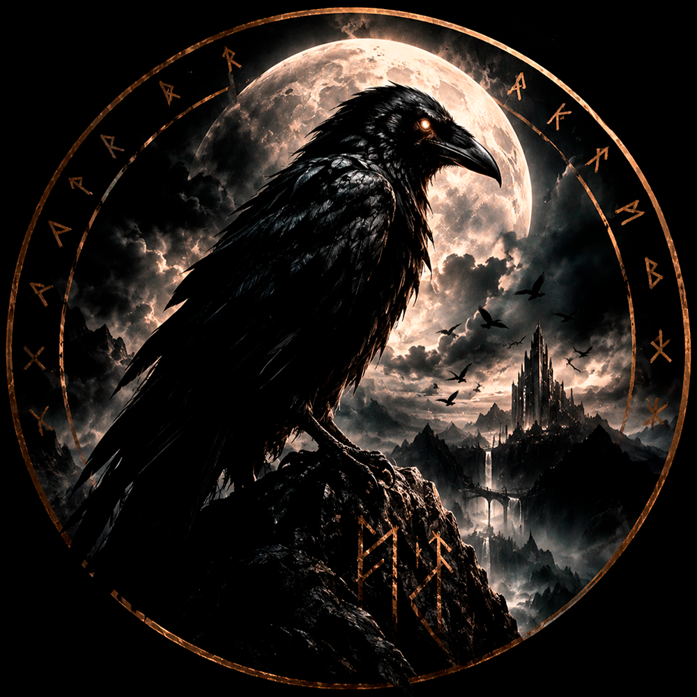
</p>

# Munin 🐦‍⬛

<a href="docs/landed.PNG">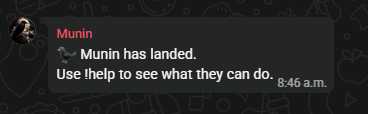</a>

Munin is an AI-powered WhatsApp group assistant built with Node.js. Inspired by **Muninn**, the raven of memory and messanger of Odin from Norse mythology, Munin can join group conversations, remember and retrieve important messages, understand natural language requests, and handle useful commands all while maintaining its own witty, raven-inspired personality. Munin can also liven up a group chat with fun features like trivia, image generation, per-group custom commands, user stats tracking, and a quest to collect its ultra rare feathers.

Unlike general-purpose assistants like Meta AI, Munin lives within the group: remembering context, managing reminders and alerts, saving important messages, bringing chaos to the chat with games and other interactive features, and performing actions through fully customizable tools.

Not just a companion you can talk to, but one that can be tailored specifically for your group.

_This project uses whatsapp-web.js, an unofficial WhatsApp Web automation approach rather than an official WhatsApp bot API and is not affiliated with WhatsApp/Meta in any way._

---

## Screenshots

### Everyday group assistance

<table>
  <tr>
    <td align="center" width="33%"><a href="docs/help.PNG">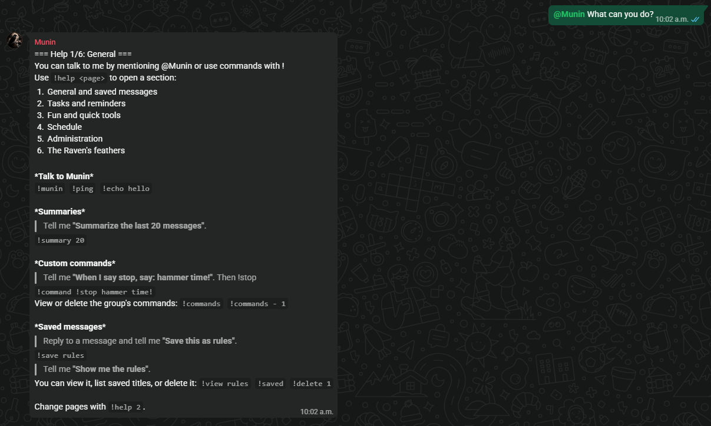</a><br><sub>Help menu</sub></td>
    <td align="center" width="33%"><a href="docs/saved-messages.PNG">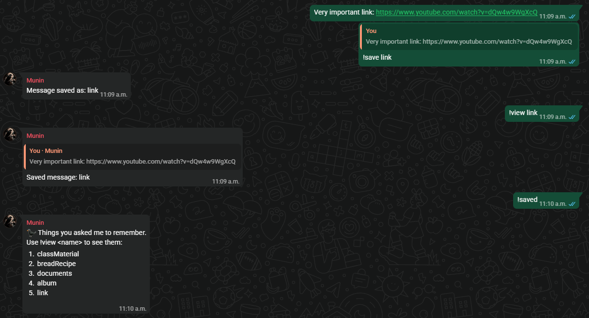</a><br><sub>Saved messages</sub></td>
    <td align="center" width="33%"><a href="docs/reminders.PNG">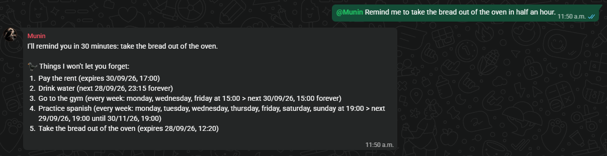</a><br><sub>Recurring reminders</sub></td>
  </tr>
</table>

### Group activity

<table>
  <tr>
    <td align="center" width="33%"><a href="docs/report.PNG">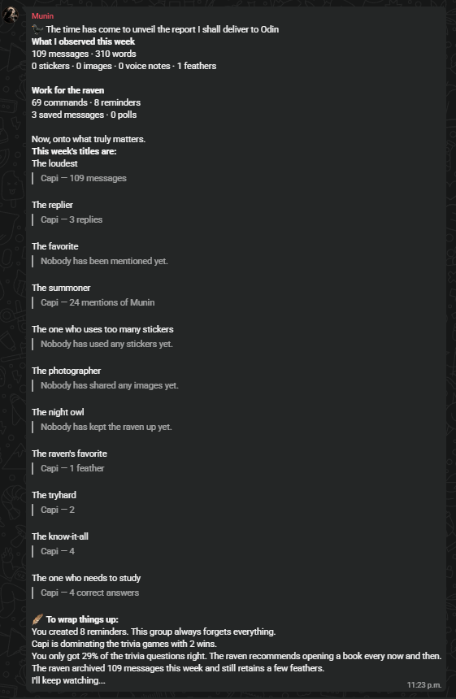</a><br><sub>Weekly group report</sub></td>
    <td align="center" width="33%"><a href="docs/stats.PNG">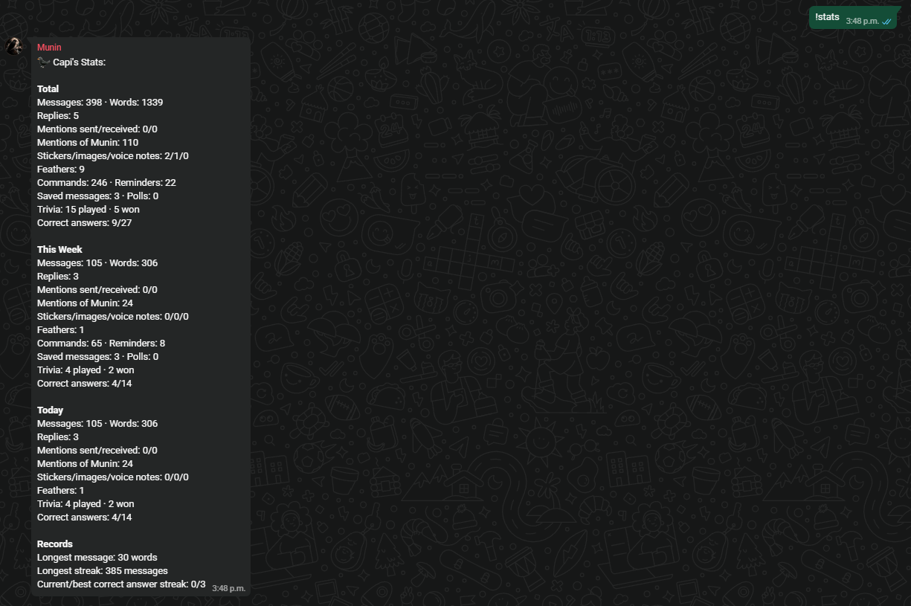</a><br><sub>Per-user statistics</sub></td>
    <td align="center" width="33%"><a href="docs/trivia.PNG">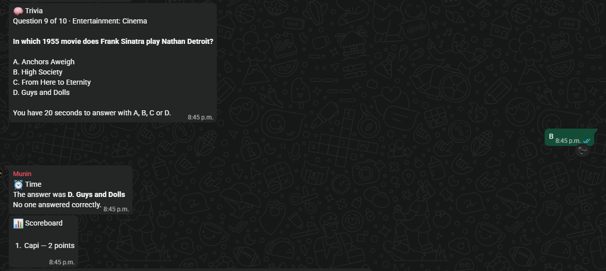</a><br><sub>Live trivia</sub></td>
  </tr>
</table>

### More examples

<table>
  <tr>
    <td align="center" width="33%"><a href="docs/weather.PNG">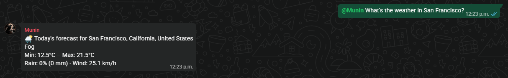</a><br><sub>Weather forecasts</sub></td>
    <td align="center" width="33%"><a href="docs/pending-items.PNG">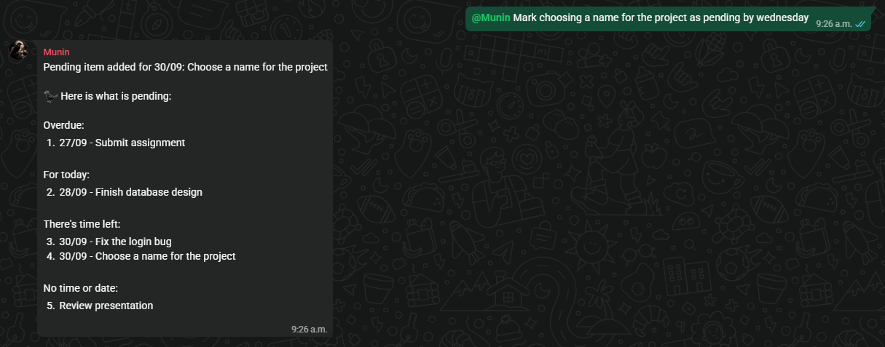</a><br><sub>Shared pending items</sub></td>
    <td align="center" width="33%"><a href="docs/image-generation.PNG">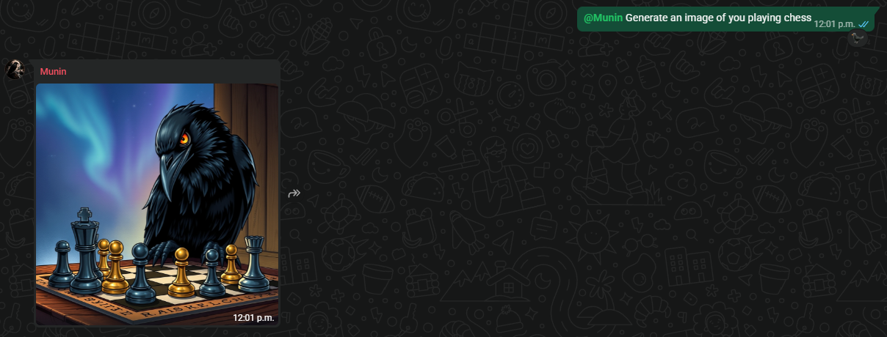</a><br><sub>Image generation</sub></td>
  </tr>
</table>

---

## Features

### AI group assistant

- Converses naturally and chooses from dedicated tools when appropriate
- Summarizes recent messages and suggests similarly named commands
- Can react to messages and even award rare raven feathers to exceptional contributions

### Planning and memory

- Save and retrieve quoted messages without limits (better than WhatsApp pins)
- Create one-time, absolute, relative, and recurring reminders
- Maintain dated pending items and receive a daily pending summary
- Manage a weekly class schedule and optional class-bell reminders

### Group activity

- Per-user, per-group daily, weekly, and lifetime statistics
- Weekly group reports with activity leaders, trivia results, and observations
- Optional automatic Sunday reports
- Group trivia sessions with answer timers, live scoreboards, and leaderboards

### Fun commands and utilities

- Weather forecasts for the configured location or a named location
- Random cat and dog images
- LLM image generation with per-user cooldowns
- Polls, timers, coin flips, dice, random choices, and an eight-ball

### Administration

- Choose who can use the AI in group chats (bans) and when to pause Munin
- Manage admin permissions per group
- Single immutable global admin

---

## Technology Stack

| Category      | Technologies                                                                                                                                                                                                                                                                                                                                                                                               |
| ------------- | ---------------------------------------------------------------------------------------------------------------------------------------------------------------------------------------------------------------------------------------------------------------------------------------------------------------------------------------------------------------------------------------------------------- |
| Runtime       |                                                                                                                                                                                                                            |
| WhatsApp      | [](https://wwebjs.dev/)                                                                                                                                                                                    |
| AI            |                                                                                                                                                                                                                                                           |
| Storage       |                                                                                                                                                                                                                                                                                                                                 |
| External APIs |      |

---

## Installation

### Prerequisites

- Node.js 18 or newer
- A WhatsApp account available to link by QR code
- A Groq API key
- API keys for the optional cat, dog, and image-generation integrations

### Run locally

Clone the repository and install dependencies:

```bash
git clone https://github.com/CapiMDR/Munin.git
cd Munin
npm install
```

Create a `.env` file in the repository root:

```env
GROQ_API_KEY=your_groq_key

# Optional animal-image commands
THE_CAT_API_KEY=your_cat_api_key
THE_DOG_API_KEY=your_dog_api_key

# Optional Cloudflare image generation
CLOUDFLARE_ACCOUNT_ID=your_cloudflare_account_id
CLOUDFLARE_API_TOKEN=your_cloudflare_api_token

# Optional global administrator WhatsApp ID
GLOBAL_ADMIN_ID=1234567898765@c.us

# Optional default weather location (Ciudad de México is used when omitted)
MUNIN_LATITUDE=19.4326
MUNIN_LONGITUDE=-99.1332
MUNIN_LOCATION_NAME=Ciudad de México
```

Start Munin:

```bash
node src/munin.js
```

Scan the QR code shown in the terminal with WhatsApp. Authentication data is retained locally by `whatsapp-web.js`, so later starts normally do not require linking again.
Persistence directory `/data` is created at runtime.

### Optional settings

`src/config/settings.js` supports these environment variables:

- `TEST_MODE=true` — ignore normal groups while testing.
- `TEST_CHAT_ID=<chat id>` — allow one chat through test mode.
- `SEND_MAINTENANCE_MESSAGE=true` — explain test-mode silence to users.
- `FEATHER_COOLDOWN_MS=<milliseconds>` — feather cooldown per user and group.
- `IMAGE_GENERATION_COOLDOWN_MS=<milliseconds>` — image-generation cooldown per user and group.

---

## Administration

Administration is scoped per group. Set `GLOBAL_ADMIN_ID` in `.env` to bootstrap a trusted administrator across every group:

```env
GLOBAL_ADMIN_ID=1234567898765@c.us
```

Use the WhatsApp identifier format shown above—digits plus `@c.us`. The global administrator can manage every group and cannot be removed by group administrators.

### Group administrators

| Command             | Purpose                                                             |
| ------------------- | ------------------------------------------------------------------- |
| `!config`           | Show the group's administrators and active bans                     |
| `!admin @usuario`   | Grant a user administrator access in the current group              |
| `!noadmin @usuario` | Remove a group administrator; the global administrator is protected |

### Moderation and pause controls

| Command                           | Purpose                                                                       |
| --------------------------------- | ----------------------------------------------------------------------------- |
| `!ban @usuario <cantidad><m/h/d>` | Ignore a user in the current group for a duration, for example `!ban @Ana 2h` |
| `!ban @usuario inf`               | Ignore a user until explicitly unbanned                                       |
| `!unban @usuario`                 | Restore a banned user's access                                                |
| `!pausa <cantidad><m/h/d>`        | Pause Munin in the current group for a duration                               |
| `!pausa inf`                      | Pause Munin until an administrator resumes it                                 |
| `!despausa`                       | Resume Munin in the current group                                             |

When a group is paused, Munin ignores normal interaction in that group. Bans and pauses are stored locally in `data/admins.json`.

### Automatic weekly reports

Automatic reports are disabled by default. Anyone in a group can use `!usarreporte` to toggle them. When enabled, Munin sends the report every Sunday at 18:00 in the configured Mexico City timezone. If it was offline at that time, it sends the missed report after reconnecting.

---

## Project Structure

```text
src/
├── ai/             # LLM client, prompts, tools, summaries
├── apis/           # External API adapters
├── bootstrap/      # Application composition and factories
├── config/         # Commands and runtime settings
├── handlers/       # WhatsApp input, commands, and tool execution
├── presenters/     # User-facing response formatting
├── schedulers/     # Reminders, pendings, classes, weekly reports
├── services/       # Feature validation and application logic
├── stores/         # JSON-backed persistence
└── utils/          # Date, time, and message helpers

data/               # Local persisted bot data
docs/               # README artwork and screenshots
```

---

## Commands

Use `!ayuda` in a group for the complete, current paginated command list. Common commands include:

| Command                          | Purpose                               |
| -------------------------------- | ------------------------------------- |
| `!guardar`, `!ver`, `!guardados` | Save and retrieve quoted messages     |
| `!r`                             | Create or manage reminders            |
| `!p`                             | Create, list, or remove pending items |
| `!clima`                         | Get a weather forecast                |
| `!trivia`                        | Start group trivia                    |
| `!stats`, `!reporte`             | View personal and group activity      |
| `!comando`                       | Create a custom fixed-reply command   |
| `!gato`, `!perro`                | Send a random animal image            |

You can also mention Munin naturally; the LLM can use supported tools when it understands the request.

---

## Data and Privacy

Munin stores its operational data locally in `data/`, including group configuration, saved messages, reminders, schedules, and statistics. It connects to third-party APIs only for the features that require them. Review each API provider's terms and privacy policy before deploying Munin in a group.

---

## Roadmap

Planned features include:

- Support for automatic translation
- More external API tools
- Improved memory for the LLM using per user context
- More games and fun commands (chess?)

---

## Contributing

Contributions, bug reports, and feature requests are welcome. Feel free to open an issue or submit a pull request.

---

## Author

Developed by **CapiMDR**. If you enjoy the project, consider starring the repository ⭐
